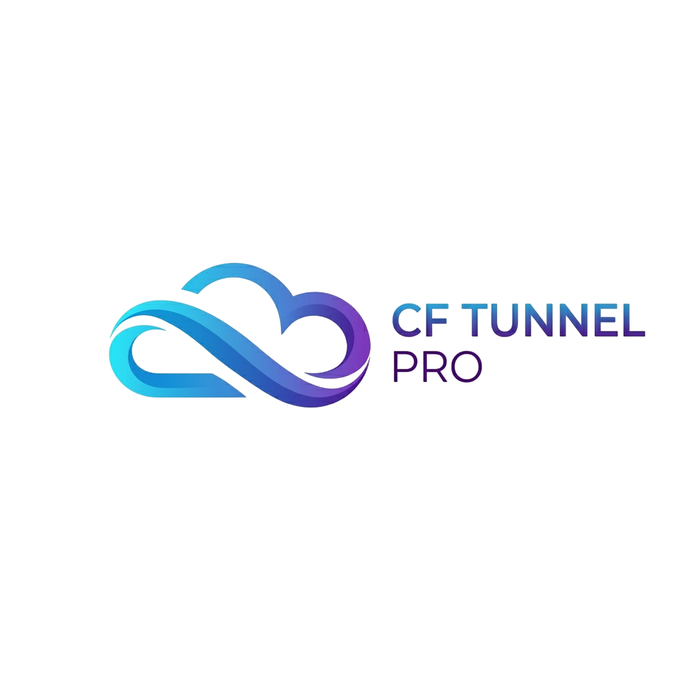

<div align="center">
  
</div>

# CF Tunnel Pro

**CF Tunnel Pro** is a modern, lightweight, and permanent web-based dashboard to manage Cloudflare Tunnels on your Linux VPS. Built entirely with Node.js and Vanilla JS/Tailwind CSS, it provides a premium graphical interface to run Cloudflare Tunnels (both Custom Domain and Temporary) easily.

Created by **Kawditha Nirmal**.

## Features

- **Lifetime Authentication**: Secure login portal with lifetime session persistence (via encrypted tokens) so you only need to login once per device.
- **Cloudflare Account Authorization**: Connect your Cloudflare account directly from the UI and fetch your authorized domains automatically.
- **Custom Domain Tunnels (Named Tunnels)**: Route any custom subdomain (e.g., `app.yourdomain.com`) to a local VPS port with 1 click.
- **Temporary Quick Tunnels**: Quickly expose a port without a Cloudflare account using ephemeral `trycloudflare.com` URLs.
- **Permanent Tunnels & Auto-Restart**: Select the "Run Permanently" option, and your tunnel will automatically start running in the background. Even if your VPS restarts, CF Tunnel Pro's daemon will automatically relaunch your permanent tunnels!
- **Tunnel Manager**: View a real-time list of all active/offline tunnels, stop/start them instantly, or delete them.

## Requirements

- A Linux VPS (Ubuntu/Debian or CentOS/RHEL recommended).
- A domain name connected to your Cloudflare account (if you want to use custom domain tunnels).
- Port `1215` open in your firewall.

## Installation (Linux)

Run the automated installer script as root to set up the environment, install dependencies, and register the background service.

1. Clone or copy this project to your VPS.
2. Run the installer:
   ```bash
   sudo ./install.sh
   ```
3. During installation, you will be prompted to enter a **secure password** (or one will be generated for you).
4. Wait for the success message, which will provide your login URL and password.

## Manual Run (Development)

If you just want to test it locally:
1. `npm install`
2. `node src/server.js`

## How to Use

1. Navigate to `http://<YOUR_VPS_IP>:1215` in your browser.
2. Enter your administrator password.
3. **Step 1:** Click **"Connect Cloudflare Account"**. It will generate an authorization URL. Open it in a new tab, login to Cloudflare, and authorize your domain.
4. **Step 2:** Return to CF Tunnel Pro. Once authorized, your domain will appear in the dashboard.
5. **Step 3:** Use the **Custom Domain Tunnel** card to route a subdomain (like `api`) to a local port (like `3000`). Check "Run Permanently" if you want this tunnel to survive VPS reboots.
6. Manage your tunnels from the list on the right.

## Uninstallation

To remove the background service:
```bash
sudo systemctl stop cftunnelpro
sudo systemctl disable cftunnelpro
sudo rm /etc/systemd/system/cftunnelpro.service
sudo systemctl daemon-reload
```

## Creator
**Creator = Kawditha Nirmal**
Version: v1
